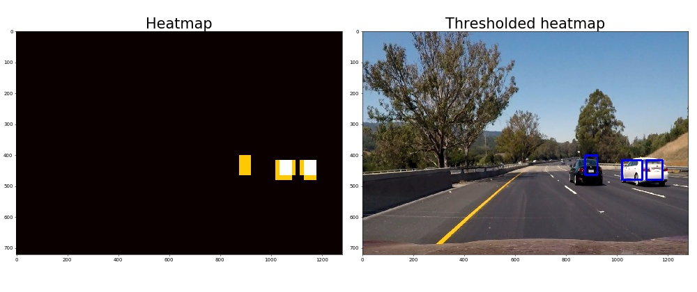
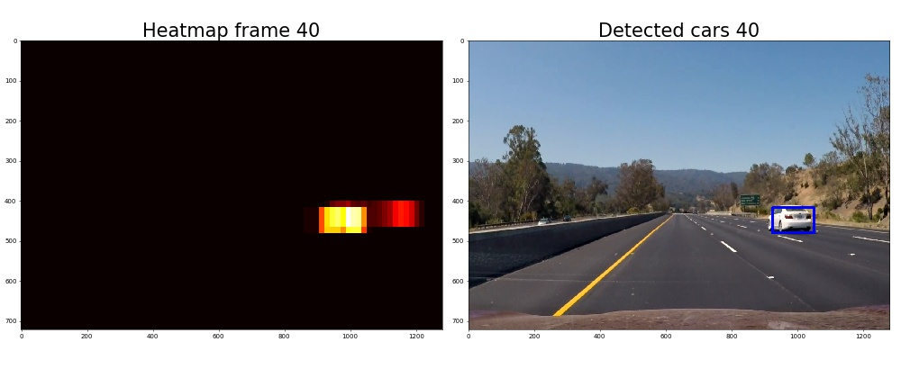
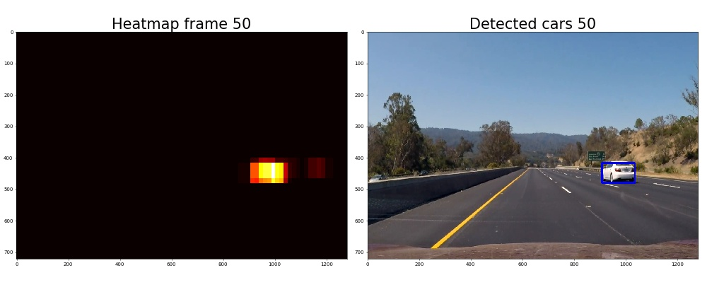

# Project: Vehicle Detection and Tracking

The goals / steps of this project are the following:

* Perform a Histogram of Oriented Gradients (HOG) feature extraction on a labeled training set of images and train a classifier Linear SVM classifier
* Optionally, you can also apply a color transform and append binned color features, as well as histograms of color, to your HOG feature vector. 
* Note: for those first two steps don't forget to normalize your features and randomize a selection for training and testing.
* Implement a sliding-window technique and use your trained classifier to search for vehicles in images.
* Run your pipeline on a video stream (start with the test_video.mp4 and later implement on full project_video.mp4) and create a heat map of recurring detections frame by frame to reject outliers and follow detected vehicles.
* Estimate a bounding box for vehicles detected.

[//]: # (Image References)
[image1]: ./examples/car_not_car.png
[image2]: ./examples/HOG_example.jpg
[image3]: ./examples/sliding_windows.jpg
[image4]: ./examples/sliding_window.jpg
[image5]: ./examples/bboxes_and_heat.png
[image6]: ./examples/labels_map.png
[image7]: ./examples/output_bboxes.png
[video1]: ./project_video.mp4

In the following, I will consider each [rubric](https://review.udacity.com/#!/rubrics/513/view) point individually and describe how I addressed it in my implementation.

The entire implementation is contained in the four python scripts `Features.py`, `Detection.py`, `Train_Vehicle_Detection.py` and `Test_Vehicle_Detection.py`.
Additionally, a fifth python script, `ExampleImages.py`, is used for generating example images.

---
###Histogram of Oriented Gradients (HOG)

####1. Explain how (and identify where in your code) you extracted HOG features from the training images. Explain how you settled on your final choice of HOG parameters.

The code for this step is contained in `Features.py` and `Train_Vehicle_Detection.py`.

In `Train_Vehicle_Detection.py`, I start by loading in the annotated examples of cars and non-cars from the vehicles dataset.
Two examples are shown below.

I then split the dataset into a training set and a test set, as the first thing.
**Note that this is different from the Udacity sample code that cheats by using all of the data to fit the feature normalization parameters.**
I therefore expect to get slightly worse performance on the test set, but to generalize slightly better on new, unseen data.

I then extract HOG features for all training and test examples, by calling `extract_features_from_image_list()` in `Features.py`. This function reads the images individually and calls  `extract_features()` that performs color space conversion and then further calls `get_hog_features()` to extract HOG features for each color channel.
These features are then concatenated in the dimension of HOG orientations.
An example visualization for a car and non-car HOG image for a single color channel is shown below.

In order to decide on the various parameters for the HOG feature extraction, I have evaluated these individually by training a new linear SVM classifier for each setting. The accurary on the test set are reported for each parameter setting:

Colorspaces: RGB=0.9665, HSV=0.9848, LUV=0.9848, HLS=0.9814, YUV=0.9859, **YCrCb=0.9862**

- HSV, LUV, HLS, YUV, and YCrCb performed similarly, with a slight advantage to YCrCb. Therefore, I went with this.

Orients: 3=0.9659, 5=0.9797, 7=0.9845, **9=0.9868**, 11=0.9873, 13=0.9896, 15=0.9882

- The best performance was achieved with 13 orientations. However, this results in a significantly higher feature dimension space, with only slightly better performance. Therefore, I went with 9 orientations.

pix_per_cell: 4=0.9868, **8=0.9896**, 16=0.9814, 32=0.9789

- The best performance was achieved with 8 pixels/cell. Therefore, I went with this setting.

cell_per_block: 1=0.9817, **2=0.9851** , 4=0.9837 , 8=0.9769

- The best performance was achieved with 2 cells/block. Therefore, I went with this setting.

hog_channels: 0=0.9482 , 1=0.8981 , 2=0.9245 , ALL=**0.9862**

- The best performance was achieved with HOG calculated on all 3 color channels. Therefore, I went with this configuration.

Combined, I got a feature vector of dimension `7x7x2x2x9x3 = 5292` for each example.
This is used for the following supervised classification.

####2. Describe how (and identify where in your code) you trained a classifier using your selected HOG features (and color features if you used them).
The code for this step is contained in `Train_Vehicle_Detection.py`.

The HOG features are first normalized by fitting normalization parameters for the `StandardScaler()` function on the training examples.
These parameters are then used to normalize features for both training and test examples.

I then train a linear SVM using default parameters, and the function `svc.fit()`.
For a feature vector of size 5292 and 14208 training examples, this takes roughly seconds.

I then evaluate the performance on the test data with the function `svc.score()`, where I get an accuracy of 98.85%.

Ultimately, I save the trained model and its parameters as a picle-file.

###Sliding Window Search

####1. Describe how (and identify where in your code) you implemented a sliding window search. How did you decide what scales to search and how much to overlap windows?
The code for this step is contained in `Detection.py` and `Test_Vehicle_Detection.py`.

The sliding window search is performed in the `find_cars()` function in `Detection.py`.
Here, the input image is first cropped in the y-dimension, such that we don't search for vehicles in the sky.

Next, we loop over the requested scales, such that the window search is performed on multiple scales.
I use four scales: 2.4, 1.8, 1.4, and 1.
This was found by trial-and-error with qualitative evaluation of the detection results.
Since the training examples were all 64x64 pixels, we effectively search with windows of size 154x154, 115x115, 90x90 and 64x64.
The implementation, however, resizes the image instead of the windows.
In this way, we can use the same classifier and feature extraction process for all scales.

Next, I use the sample code provided by Udacity to sub-sample HOG windows.
In this way, HOG features are calculated once (for each scale) for the entire image, and overlapping windows can then be searched without having to recalculate HOG features.

Each HOG window is then fed to the SVM classifier (trained in the above steps) that outputs whether the window represents a car (1) or not (0).

If the window represents a car, the coordinates are added to a list of vehicle detections.
An example of detections with overlaid bounding boxes (window coordinates) is shown below for two individual frames.
Clearly, there are a lot of false positives.

####2. Show some examples of test images to demonstrate how your pipeline is working. How did you optimize the performance of your classifier?
The code for this step is contained in `Detection.py` and `Test_Vehicle_Detection.py`.

As seen above, there are a lot of false positives.

I first add a ROI to filter out a lot of these. I use the following window parameters:

| Lower-left coords | Upper-right coords |
|:-----------------:|:------------------:|
| 500,650           | 1250,400           |

Note that this small ROI will actually only work on the specific test images and video where the lane turns slightly to the right. However, a Udacity reviewer recommended this small ROI, and therefore I am using it.
In a real-world application, either a larger ROI or an adaptive ROI utilizing information about lane curvature would be needed.
The image below shows this ROI on top of one of the test images.

In addition to providing a ROI for each frame, I also add each detection to a heatmap, initialized with zeros.
That is, for each detected window, I add the value 1 to the heatmap for all pixels inside the window.
In locations with multiple overlapping windows, the heatmap will thus have a high value, whereas for single false positive windows, the heatmap will be 1.
By thresholding this heatmap, I can filter out some of the false detections and thus improve the result.
For single frames (the test images), I use a threshold of 1, meaning that at least two window detections must overlap in order to keep the detection.
That is, non-overlapping window detections are filtered out.

In `Detection.py`, I use the list of vehicle detections provided by the `find_cars()` function described above, to construct a heatmap for each frame.
This is done in the `process_image()` function.
Subsequently, the thresholding is applied.
Ultimately, the thresholded heatmap is processed by fitting bounding boxes to connected components.
This is done with the `label()` function in *scipy.ndimage.measurements*.
These bounding boxes are then drawn on top of the original images.
I have used the sample code by Udacity to handle the heatmap and thresholding.

An example image is shown below with a thresholded heatmap and the resulting bounding boxes.

The remaining test images are available in the folder *./output_images/test_images/*.
---

### Video Implementation

####1. Provide a link to your final video output. Your pipeline should perform reasonably well on the entire project video (somewhat wobbly or unstable bounding boxes are ok as long as you are identifying the vehicles most of the time with minimal false positives.)
The code for this step is contained in `Detection.py` and `Test_Vehicle_Detection.py`.

The video can be accessed [here](./project_video_result.mp4)

####2. Describe how (and identify where in your code) you implemented some kind of filter for false positives and some method for combining overlapping bounding boxes.
The code for this step is contained in `Detection.py` and `Test_Vehicle_Detection.py`.

For the video, I have used the same processing pipeline as for the individual test images.
However, instead of just constructing a heatmap and thresholding it for each image, I use a FIFO buffer with window detections for the past 20 frames that are used to construct a combined heatmap.
This can then be thresholded with a higher threshold and thus filter out more false positives.
For single images, I used a threshold of 1.
For the video, I have used a threshold corresponding to the buffer length + 1 (=21), meaning that at least 21 overlapping window detections must have occured within the last 20 frames in order to result in a bounding box.

Examples of heatmaps (not thresholded) and resulting bounding boxes for different frames are shown below.

---

###Discussion

####1. Briefly discuss any problems / issues you faced in your implementation of this project. Where will your pipeline likely fail? What could you do to make it more robust?
For the video, there are still a few false positives.
Some of these could probably be filtered out by tuning the heatmap buffer size and threshold.

I only used HOG features and didn't experiment with other color or spatial features.
Additional features might have improved the detection results.

Also, I only experimented with a linear SVM. Nonlinear kernels such as the 'rbf' kernel might improve detection results, but also introduce significantly longer processing times.

For the window search, I have used two scales. More scales might improve detection results, but would also introduce a slower pipeline due to additional extraction of HOG features and sliding window search.

Last, but not least, I could have experimentet with other classifiers and possibly also ensemble methods, where I could combine multiple classifiers with e.g. a voting approach.